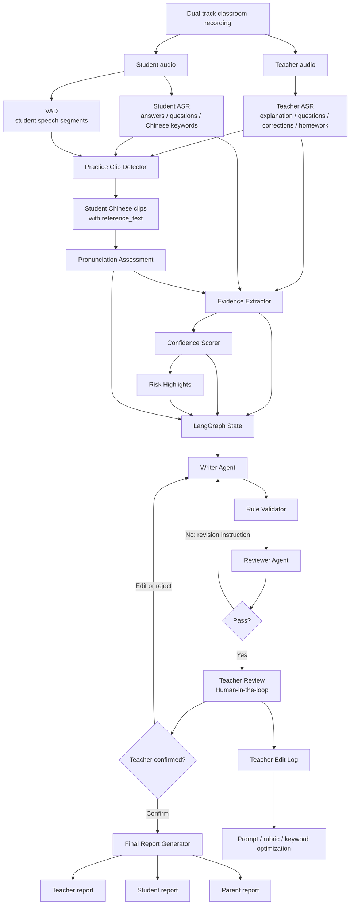
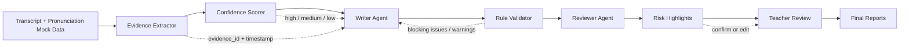
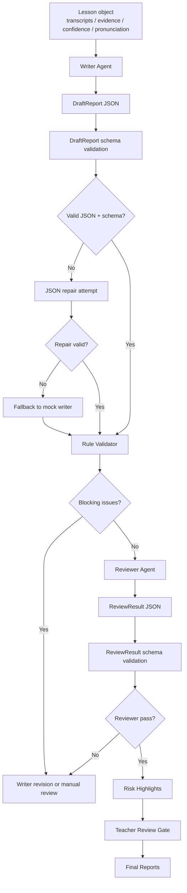

# Architecture: AI Lesson Recorder Demo

## Scope

This document describes the demo architecture for the AI Lesson Recorder MVP and the phase 2 trusted AI control points.

The goal is to support a credible end-to-end demo without requiring real ASR, real VAD, or real pronunciation assessment in the current mock stage.

## First Principle

The system is optimized for trustworthy teacher-confirmed reports, not for one-shot text generation.

Required properties:

- evidence-backed conclusions
- confidence-aware handling
- pronunciation boundary control
- automated review before teacher review
- human-in-the-loop final approval
- teacher edits as feedback data

## End-To-End Flow



## Phase 1 Demo Implementation

In phase 1, all upstream model outputs are mocked in `data/demo_lesson.json`.

Mocked:

- teacher ASR
- student ASR
- VAD results as `practice_clips`
- pronunciation assessments
- evidence
- confidence scores
- risk highlights
- draft report
- review result
- final reports

Not mocked conceptually:

- schema contract
- evidence IDs
- timestamps
- teacher review states
- rule validation warnings

This lets frontend and backend development proceed without waiting for model integration.

## Phase 2 Trusted Control Points

Phase 2 strengthens the mock demo around five control points. These are still represented as structured mock data and prompt rules; this phase does not implement real ASR, real VAD, or real pronunciation assessment.



Control point responsibilities:

| Control Point | Purpose | Demo Evidence |
|---|---|---|
| Evidence Extractor | Bind claims to transcript or assessment evidence | `evidence.*.evidence_id`, `source_segment_ids`, `timestamp` |
| Confidence Scorer | Decide whether content is confirmed, candidate, or teacher-pending | `confidence_scores`, item-level `confidence` |
| Rule Validator | Block hard failures before LLM review | `rule_validation_result.blocking_issues`, `warnings` |
| Reviewer Agent | Check completeness, clarity, parent friendliness, and boundary discipline | `review_result.rubric_scores` |
| Risk Highlight | Surface medium/low confidence content instead of hiding it | `risk_highlights` |
| Teacher Review | Keep final responsibility with the teacher | `teacher_review.status`, `pending_confirmation_ids` |

Phase 2 product principle:

```text
Low-confidence content should become a teacher decision, not a silent AI conclusion.
```

## Phase 5 Real LLM Agent Boundary

Phase 5 can replace only two deterministic mock components with real LLM calls:

- Writer Agent
- Reviewer Agent

It must not replace or bypass:

- Evidence Extractor
- Confidence Scorer
- Rule Validator
- JSON schema validation
- Risk Highlights
- Teacher Review
- Final Report teacher gate



Phase 5 fallback principle:

```text
If real LLM output is unavailable, invalid, unsafe, or unparseable, the system falls back to the stable mock path and exposes fallback_reason.
```

This keeps the demo reliable while making real model behavior observable through `agent_mode`, `model_provider`, `model_name`, `llm_trace`, `schema_validation`, and `fallback_reason`.

## Core Data Contract

The shared lesson object contains:

- `metadata`
- `transcripts`
- `practice_clips`
- `pronunciation_assessments`
- `evidence`
- `confidence_scores`
- `draft_report`
- `rule_validation_result`
- `review_result`
- `risk_highlights`
- `teacher_review`
- `final_reports`
- `teacher_edit_log`

If `shared/schema.json` is not available, `data/demo_lesson.json` acts as the concrete schema example.

## Key Modules

### 1. Dual Track Recording

Teacher track:

- explanation
- questions
- corrections
- homework
- repeat instructions

Student track:

- answers
- questions
- Chinese practice clips
- pronunciation assessment source audio

### 2. Practice Clip Detector

Inputs:

- teacher transcript
- student transcript
- student VAD segments
- course keywords

Output:

- `practice_clips`

Rules:

- High confidence if teacher gives repeat instruction and student responds in Chinese.
- Medium confidence if expected answer comes from teacher question.
- Medium or low confidence if reference text is inferred from course keywords.

### 3. Pronunciation Assessment

Inputs:

- student audio clip
- `reference_text`
- language: `zh-CN`

Output:

- pronunciation score
- accuracy
- fluency
- completeness
- prosody
- low-score words
- model confidence
- teacher confirmation requirement

Boundary:

- ASR text cannot prove pronunciation quality.
- Writer Agent can only discuss pronunciation using `pronunciation_assessments`.
- Tone-level claims require tone-level model output.

### 4. Evidence Extractor

Creates evidence objects for:

- knowledge points
- teacher questions
- student questions
- corrections
- homework
- pronunciation

Each evidence item must include:

- `evidence_id`
- `source_segment_ids`
- `timestamp`
- `claim`
- `confidence`

Phase 2 rule:

- If a report sentence describes a classroom fact, it must be traceable to an `evidence_id`.
- Correction evidence should include both the student original and the teacher correction when available.
- Homework evidence should prefer teacher-track instructions over inferred lesson goals.

### 5. Confidence Scorer

Assigns confidence to:

- homework extraction
- student question extraction
- correction extraction
- pronunciation reference text
- pronunciation feedback
- overall report reliability

Medium or low confidence content must surface in `risk_highlights`.

Phase 2 confidence behavior:

| Confidence | Behavior |
|---|---|
| high | Can enter draft report, still pending teacher final confirmation |
| medium | Can enter draft report, must be highlighted for teacher review |
| low | Candidate or boundary note only; cannot become a confirmed conclusion |
| unknown | Mark as not evaluated or ask the teacher to fill in |

### 6. Writer Agent

Generates `draft_report`.

Must obey:

- no unsupported factual claims
- no pronunciation inference from ASR
- evidence-linked report items
- low-confidence items require teacher confirmation
- parent-facing text is positive and actionable

### 7. Rule Validator

Checks hard constraints before the LLM reviewer.

Examples:

- pronunciation feedback must reference a valid assessment
- homework must reference evidence or be marked candidate
- low-confidence content must have risk highlight
- revision loop must be bounded
- reference mismatch cannot be rewritten as a confirmed pronunciation error
- parent-facing reports cannot contain unconfirmed negative claims

Rule Validator output should separate:

- `blocking_issues`: must return to Writer Agent or manual review
- `warnings`: can continue to Reviewer Agent, but must remain visible to the teacher

### 8. Reviewer Agent

Reviews soft quality:

- completeness
- evidence grounding
- pronunciation boundary
- homework actionability
- parent friendliness
- safety and privacy

Phase 2 reviewer focus:

- Evidence grounding: every factual claim has traceable support.
- Pronunciation boundary: ASR text is never used as proof of standard pronunciation.
- Low-confidence exposure: medium/low confidence content is visible in risk highlights.
- Homework actionability: homework is split, concrete, age-appropriate, and teacher-confirmable.
- Parent friendliness: parent report is positive, clear, and avoids technical or harsh wording.

### 9. Teacher Review

The teacher confirms:

- homework
- risk highlights
- pronunciation feedback
- student assessment wording
- final report readiness

AI output remains draft until teacher confirmation.

In phase 2, teacher review should prioritize:

- explicit homework from teacher evidence
- candidate homework generated by the system
- pronunciation feedback with medium or low confidence
- reference mismatch cases
- student assessment wording before parent-facing delivery

### 10. Final Report Generator

Generates:

- teacher report: detailed, evidence-aware
- student report: concise, practice-oriented
- parent report: positive, clear, actionable

## Demo Data Coverage

`data/demo_lesson.json` covers:

- English teacher explanation of Chinese sentence patterns
- Chinese student answers
- measure-word mistake: `一个果汁`
- teacher correction: `一杯果汁`
- student question: why use `杯`
- post-class read-aloud homework
- system-generated candidate homework
- mock pronunciation assessment
- pronunciation low-score words
- pronunciation assessment with empty `low_score_words`
- medium and low confidence risks
- evidence
- confidence scores
- risk highlights
- draft report
- final reports

## Integration Notes For Other Processes

Frontend can:

- render `transcripts`
- show evidence timestamps
- display `draft_report`
- show `risk_highlights`
- let teacher confirm homework and risks
- show `final_reports`

Backend can:

- serve `data/demo_lesson.json`
- implement mock analyze endpoint using existing fields
- later replace mocked modules with real pipeline steps

The current Process C outputs do not require changes to `frontend/` or `backend/`.
