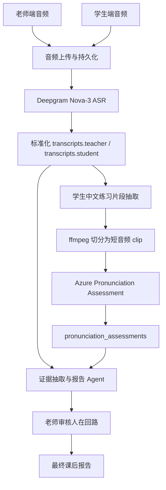

# 录音与真实音频管线开发文档

## 1. 第一性原理

录音功能本身不是目标。它的目标是把一节真实课程变成可被 AI 处理、可被老师审核、可最终发送给学生或家长的结构化教学证据。

完整链路应该是：



因此录音模块必须满足四个底层要求：

- **说话人归属准确**：老师音轨和学生音轨必须天然分离，不能依赖 ASR diarization 猜测谁在说话。
- **音频可恢复**：上传后必须先保存原始音频。ASR、发音评估或 LLM 失败时，不应该让用户重新录课。
- **下游接口稳定**：无论来源是样本、上传文件还是浏览器录音，都必须进入同一个 `/api/lessons/demo/audio-ingest`。
- **真实服务可插拔**：没有 Deepgram/Azure Key 时走 mock fallback；配置 Key 后自动进入真实链路。

## 2. 开发目标

本阶段要把项目从“样本演示”推进到“真实录音可跑通”的工程状态。

目标能力：

- 前端可以录制老师端音频和学生端音频。
- 前端可以预览、删除、重录每条音轨。
- 前端把录音文件通过 multipart form 上传到现有 `/audio-ingest`。
- 后端保存原始音频文件，并返回文件元数据。
- 后端在配置阿里云百炼 Fun-ASR 后调用真实 ASR。
- 后端从学生 transcript 中抽取中文练习片段。
- 后端把对应学生音频切成短 clip，再送 Azure 做发音评估。
- 任一外部服务未配置或失败时，系统可退回 mock，不阻断 demo。

## 3. 开发顺序

真实流程建议按下面顺序开发，原因是每一步都依赖上一步的数据契约。

| 阶段 | 优先级 | 目标 | 原因 |
|---|---:|---|---|
| R1 | 1 | 后端音频持久化 | 没有持久化就无法稳定重试 ASR 和发音评估 |
| R2 | 2 | 百炼 Fun-ASR | 先得到真实 transcript，后续片段抽取才有依据 |
| R3 | 3 | 学生中文片段抽取 | Azure 不应评估整节课，只评估短中文练习片段 |
| R4 | 4 | Azure 发音评估 | 依赖 R3 的 clip 和 reference text |
| R5 | 5 | 网页录音入口 | 最后接 UI，避免前端先做完但后端真实链路不可用 |

说明：如果要快速演示，可以先做 R5 的 mock 录音入口，但正式真实链路应优先保证后端处理闭环。

## 4. 输入模式

前端音频来源统一抽象为 `AudioSource`：

```ts
type AudioSource = "sample" | "upload" | "record";
```

三种来源进入同一接口：

- `sample`：标准样本或长课程样本。
- `upload`：用户上传已有老师/学生音频文件。
- `record`：浏览器通过 `MediaRecorder` 生成音频文件。

接口不能因为来源不同而分裂。否则后续 ASR、片段抽取、发音评估、报告生成会出现重复逻辑。

## 5. 前端录音设计

### 5.1 录音模式

MVP 使用“单机双文件录音”：

- 录老师音轨一次。
- 录学生音轨一次。
- 老师端和学生端音频分别上传。

暂不做远程双端实时录音，因为它需要 WebRTC、房间管理、连接状态、远程权限、断线恢复，复杂度明显高于当前 demo 需要。

### 5.2 状态变量

```ts
type RecordingTrack = "teacher" | "student";
type RecordingStatus = "idle" | "recording" | "stopped" | "error";

interface RecordedTrack {
  track: RecordingTrack;
  blob: Blob;
  filename: string;
  mimeType: string;
  durationSeconds: number;
  objectUrl: string;
}
```

推荐 React state：

```ts
const [recordingTrack, setRecordingTrack] = useState<RecordingTrack | null>(null);
const [recordingStatus, setRecordingStatus] = useState<RecordingStatus>("idle");
const [teacherRecording, setTeacherRecording] = useState<RecordedTrack | null>(null);
const [studentRecording, setStudentRecording] = useState<RecordedTrack | null>(null);
const [recordingError, setRecordingError] = useState<string | null>(null);
const [recordingConsent, setRecordingConsent] = useState(false);
```

浏览器对象必须放在 ref，避免重渲染破坏录音过程：

```ts
const mediaRecorderRef = useRef<MediaRecorder | null>(null);
const mediaStreamRef = useRef<MediaStream | null>(null);
const chunksRef = useRef<Blob[]>([]);
const recordingStartedAtRef = useRef<number | null>(null);
```

### 5.3 浏览器 API

使用：

```ts
navigator.mediaDevices.getUserMedia({ audio: true });
new MediaRecorder(stream, { mimeType });
```

MIME 类型优先级：

```ts
audio/webm;codecs=opus
audio/webm
browser default
```

停止录音后必须释放麦克风：

```ts
mediaStreamRef.current?.getTracks().forEach((track) => track.stop());
```

### 5.4 前端 UI 要求

录音页至少包含：

- 输入模式选择：样本 / 上传 / 浏览器录音。
- 录音授权确认。
- 老师音轨卡片：开始、停止、重录、预览、时长。
- 学生音轨卡片：开始、停止、重录、预览、时长。
- 提交按钮：只有两条音轨都存在时可点击。
- 错误提示：浏览器不支持、权限拒绝、录音失败。

### 5.5 上传格式

录音 Blob 转为 File：

```ts
const file = new File(
  [recording.blob],
  recording.filename,
  { type: recording.mimeType }
);
```

上传字段：

```text
teacher_audio: File
student_audio: File
mode: mock
include_pronunciation: true
input_source: record
lesson_metadata: JSON string
```

## 6. 后端接口契约

继续使用现有接口：

```http
POST /api/lessons/demo/audio-ingest
Content-Type: multipart/form-data
```

表单字段：

| 字段 | 类型 | 必填 | 说明 |
|---|---|---:|---|
| `teacher_audio` | file | record/upload 必填 | 老师音轨 |
| `student_audio` | file | record/upload 必填 | 学生音轨 |
| `mode` | string | 是 | 当前保留 `mock`，表示 demo 入口 |
| `include_pronunciation` | boolean | 否 | 是否生成发音评估 |
| `use_sample` | boolean | 否 | 是否使用内置样本 |
| `sample_id` | string | 否 | `standard` 或 `extended` |
| `input_source` | string | 是 | `sample` / `upload` / `record` |
| `lesson_metadata` | JSON string | 否 | 学生、老师、主题、日期、时长 |

响应中必须保留：

```ts
audio_ingest: {
  input_source: "sample" | "upload" | "record";
  asr_mode: "mock" | "deepgram";
  pronunciation_mode: "mock" | "azure" | "skipped";
  fallback_reason: string;
  pipeline: Array<{ step: string; status: string }>;
  tracks: {
    teacher: UploadedFileSummary;
    student: UploadedFileSummary;
  };
}
```

## 7. 后端音频持久化

文件保存路径：

```text
.uploads/
  lessons/
    demo_001/
      teacher_teacher-recording.webm
      student_student-recording.webm
      clips/
        clip_001.wav
        clip_002.wav
```

保存原则：

- 先保存原始音频，再调用外部服务。
- 返回相对路径，避免前端依赖本机绝对路径。
- 限制文件大小，默认建议 `MAX_AUDIO_BYTES=104857600`。
- 校验 content type 必须是 `audio/*` 或本地调试允许的 `application/octet-stream`。

## 8. 百炼 Fun-ASR 设计

新增模块：

```text
backend/app/asr/bailian.py
```

环境变量：

```env
ASR_PROVIDER=bailian
BAILIAN_API_KEY=...
BAILIAN_ASR_MODEL=fun-asr-flash-2026-06-15
```

调用原则：

- 老师音频单独送百炼 Fun-ASR，输出 speaker 固定为 `teacher`。
- 学生音频单独送百炼 Fun-ASR，输出 speaker 固定为 `student`。
- 浏览器录音通常是 WebM，调用百炼前先转成 WAV Base64 Data URI。
- MVP 不依赖 diarization。
- Deepgram 返回结果统一标准化成项目现有 `TranscriptSegment`。

标准输出：

```ts
interface TranscriptSegment {
  segment_id: string;
  speaker: "teacher" | "student";
  start_time: number;
  end_time: number;
  text: string;
  language_tags: string[];
  asr_confidence: number;
}
```

segment id 规则：

```text
teacher: t_001, t_002, ...
student: s_001, s_002, ...
```

失败策略：

```text
百炼未配置 -> mock transcript
百炼请求失败 -> mock transcript + fallback_reason
百炼空结果 -> mock transcript + fallback_reason
```

## 9. 学生中文片段抽取

新增模块：

```text
backend/app/pipeline/practice_clip_extractor.py
```

抽取对象只来自学生 transcript：

```text
transcripts.student
```

初始规则：

- 文本包含中文字符。
- 时长在 1-20 秒之间。
- ASR confidence >= 0.60。
- 优先选择跟读、回答、角色扮演、中文句子练习。

输出：

```ts
interface PracticeClip {
  clip_id: string;
  student_segment_id: string;
  audio_uri: string;
  clip_start: number;
  clip_end: number;
  reference_text: string;
  reference_source: string;
  reference_confidence: "high" | "medium" | "low";
  should_assess_pronunciation: boolean;
}
```

reference text 选择优先级：

1. 前 60 秒内老师明确示范的中文句子。
2. 老师提问中可推断出的目标答案。
3. 学生自己的 ASR 文本作为 fallback，此时 `reference_confidence=medium/low`。

重要边界：

- ASR 只能说明“学生说了什么”，不能说明“发音是否标准”。
- 发音标准必须来自 Azure Pronunciation Assessment。
- reference text 不确定时，必须要求老师确认。

## 10. 音频切片设计

Azure 不应收到整节课音频，只应收到短中文练习片段。

使用 `ffmpeg` 从学生原始音频切片，并统一转为 Azure 更稳定支持的 WAV PCM：

```powershell
ffmpeg -y `
  -ss <clip_start> `
  -t <duration> `
  -i <student_audio_path> `
  -vn `
  -ac 1 `
  -ar 16000 `
  -c:a pcm_s16le `
  <clip_id>.wav
```

为什么要转 WAV：

- 浏览器录音通常是 WebM/Opus。
- Azure Speech SDK 对 WAV PCM 兼容性更稳定。
- 统一采样率和声道数可以减少发音评估失败。

如果本机没有 `ffmpeg`：

- 不调用 Azure。
- 返回 mock pronunciation。
- `fallback_reason` 写明 `ffmpeg clip slicing unavailable`。

## 11. Azure 发音评估设计

新增模块：

```text
backend/app/pronunciation/azure.py
```

环境变量：

```env
PRON_PROVIDER=azure
AZURE_SPEECH_KEY=...
AZURE_SPEECH_REGION=...
AZURE_PRON_LANGUAGE=zh-CN
```

调用输入：

- `clip.audio_uri` 对应的 WAV 文件。
- `clip.reference_text`。
- `AZURE_PRON_LANGUAGE=zh-CN`。

标准输出：

```ts
interface PronunciationAssessment {
  assessment_id: string;
  clip_id: string;
  reference_text: string;
  pronunciation_score: number;
  accuracy_score: number;
  fluency_score: number;
  completeness_score: number;
  prosody_score?: number;
  low_score_words: LowScoreWord[];
  model_confidence: "high" | "medium" | "low";
  teacher_confirmation_required: boolean;
}
```

老师确认规则：

- `reference_confidence` 不是 high。
- `pronunciation_score` 低于阈值。
- word-level error type 不明确。
- ASR 置信度低。
- 音频切片过短、过长或噪声明显。

## 12. Pipeline 路由逻辑

后端核心路由：

```text
收到 audio-ingest
  -> 保存 teacher_audio/student_audio
  -> 如果 Deepgram 配置完整：调用真实 ASR
  -> 否则：使用 mock transcript
  -> 从学生 transcript 抽取 practice_clips
  -> 如果 Azure 配置完整且 ffmpeg 可用：切片并评分
  -> 否则：生成 mock pronunciation_assessments
  -> 进入现有 LangGraph/报告生成管线
```

状态标记：

```text
asr_mode=mock | deepgram
pronunciation_mode=mock | azure | skipped
fallback_reason=<可读原因>
```

这几个字段必须展示到前端，方便面试 demo 时解释当前是 mock 还是 real provider。

## 13. 开发任务拆分

### R1 后端音频持久化

负责人：后端进程。

任务：

- 为 `/audio-ingest` 增加 `input_source` 和 `lesson_metadata`。
- 保存上传/录制音频到 `.uploads/lessons/{lesson_id}/`。
- 返回文件名、content type、size、local path、uri。
- 增加文件大小和类型校验。

验收：

- 上传两个音频文件后，本地能看到保存文件。
- 响应中 `audio_ingest.tracks.teacher/student.status=received`。
- 缺文件、超大文件、非音频文件返回清晰 400。

### R2 百炼 Fun-ASR

负责人：后端进程。

任务：

- 实现 `backend/app/asr/bailian.py`。
- 读取 `BAILIAN_API_KEY` 和 `BAILIAN_ASR_MODEL`。
- 老师/学生音频分别转写。
- 标准化输出到 `transcripts.teacher/student`。
- 保留 mock fallback。

验收：

- 无 Key 时正常 mock，不报错。
- 有 Key 时返回真实 ASR transcript。
- transcript segment speaker 不混淆。

### R3 学生中文片段抽取

负责人：后端 Pipeline 进程。

任务：

- 实现 `practice_clip_extractor`。
- 从 `transcripts.student` 里识别中文练习句。
- 生成 `practice_clips`。
- 标记 reference source 和 confidence。

验收：

- 学生中文句子能生成 clip。
- 英文闲聊不生成 clip。
- 每个 clip 都能追溯到 `student_segment_id`。

### R4 Azure Pronunciation Assessment

负责人：后端进程。

任务：

- 实现 `backend/app/pronunciation/azure.py`。
- 用 ffmpeg 把学生练习片段切成 WAV PCM。
- 调用 Azure Pronunciation Assessment。
- 标准化分数和 low-score words。
- 不确定结果打上 `teacher_confirmation_required=true`。

验收：

- 有 Azure Key 和 ffmpeg 时生成真实 `pronunciation_assessments`。
- 无 Key 或 ffmpeg 不可用时进入 mock fallback。
- 不把整节课音频送去发音评估。

### R5 前端网页录音

负责人：前端进程。

任务：

- 新增 `record` 输入模式。
- 实现老师/学生两张录音卡片。
- 使用 `MediaRecorder` 录音。
- 支持预览、删除、重录。
- 把录音转成 File 后上传到 `/audio-ingest`。

验收：

- 浏览器能请求麦克风权限。
- 老师音轨和学生音轨都能录制并预览。
- 上传后后端 `input_source=record`。
- 样本和上传模式不受影响。

## 14. 测试计划

### 后端测试

```powershell
py -3.13 -m compileall backend
```

接口测试：

```text
POST /api/lessons/demo/audio-ingest with sample
POST /api/lessons/demo/audio-ingest with uploaded audio files
POST /api/lessons/demo/audio-ingest with recorded webm files
```

必须检查：

- `audio_ingest.input_source`
- `audio_ingest.tracks`
- `audio_ingest.asr_mode`
- `audio_ingest.pronunciation_mode`
- `audio_ingest.fallback_reason`
- `transcripts.teacher/student`
- `practice_clips`
- `pronunciation_assessments`

### 前端测试

```powershell
cd frontend
npm run build
```

浏览器手测：

- 打开新建课程。
- 选择浏览器录音。
- 授权麦克风。
- 录老师音轨。
- 录学生音轨。
- 预览两条音频。
- 重录其中一条。
- 提交并进入老师工作台。

### 真实服务测试

真实百炼 Fun-ASR：

```env
ASR_PROVIDER=bailian
BAILIAN_API_KEY=...
BAILIAN_ASR_MODEL=fun-asr-flash-2026-06-15
```

真实 Azure：

```env
PRON_PROVIDER=azure
AZURE_SPEECH_KEY=...
AZURE_SPEECH_REGION=...
AZURE_PRON_LANGUAGE=zh-CN
```

真实链路验收：

- `asr_mode=bailian`
- `pronunciation_mode=azure`
- pipeline 显示 `deepgram_asr` 和 `azure_pronunciation_assessment`
- 发音评估结果来自短 clip，而不是整节课音频。

## 15. 风险与控制

| 风险 | 控制 |
|---|---|
| 浏览器拒绝麦克风权限 | 保留上传文件入口 |
| 用户刷新页面导致录音丢失 | MVP 可接受；后续加 IndexedDB 草稿保存 |
| 老师/学生音轨混淆 | UI 和上传字段强制分离 |
| WebM 无法被 Azure 稳定识别 | ffmpeg 统一转 WAV PCM |
| ASR 识别错中文 | LLM 报告必须引用 evidence，并允许老师审核 |
| 发音误判 | 低置信度和低分结果必须老师确认 |
| 外部 API Key 缺失 | mock fallback，不阻断 demo |
| 成本过高 | 只对学生中文短 clip 做 Azure 评估 |

## 16. 最终完成定义

录音功能不能只看“前端能录到声音”。完整完成定义是：

- 前端录音生成的老师/学生文件可以上传。
- 后端保存原始音频。
- 有 Deepgram Key 时能生成真实 transcript。
- 学生中文片段能被抽取为 `practice_clips`。
- 有 Azure Key 和 ffmpeg 时能生成真实发音评分。
- 没有外部 Key 时仍能稳定 fallback 到 mock。
- 报告生成、老师审核、最终报告流程不被录音改动破坏。
